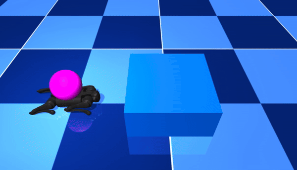
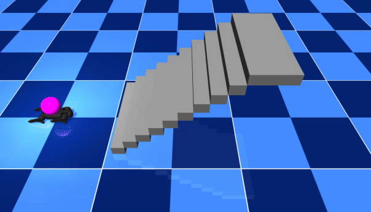
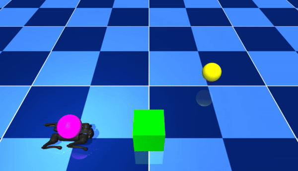

# Whole Body MPPI

A Python implementation of a **Model Predictive Path Integral (MPPI)** controller for whole-body motion tasks of a quadruped robot in simulation. This project includes tasks such as general locomotion and box-pushing, with interactive Jupyter Notebooks to explore different functionalities.

<center>


</center>

---
## **Release Note**  
* 🤖🐕 [2024/11/21] This is the **first release** of the Whole Body MPPI project. Key highlights of this release include:
    - Provides complete **MPPI controller implementations** for whole-body motion in simulation environments.
    - Focused entirely on **simulation tasks** for quadruped robots, showcasing general locomotion, stair climbing, and box pushing.
    - Includes interactive **Jupyter Notebooks** for experimenting with different MPPI tasks and configurations.

* 🔔 Future updates:
    - The **hardware implementation code** for deploying these tasks on Unitree Go1 will be released soon.
---

## Contents
- [Installation](#installation)
- [Tasks](#tasks)
- [Notebooks](#notebooks)
- [Simulation](#simulation)
- [Definitions](#definitions)
- [License](#license)

---

## Installation

### Prerequisites
- Python 3.9 or higher
- [Conda](https://docs.conda.io/en/latest/) (recommended for managing environments)

### Steps
1. **Create a Conda Environment**  
   Create and activate a dedicated environment for this project:
   ```bash
   conda create --name whole-body-mppi python=3.9 -y
   conda activate whole-body-mppi
   ```
2. **Install the Package**
    Install the required Python packages:
    ```bash
    pip install -e .
    ```
---
## Tasks
### General locomotion tasks

<center>

| **Walk Straight Task**                            | **Walk Octagon Task**                    |
|:----------------------------------------:|:----------------------------------------:|
|                |        |

| **Big Box Task**                          | **Stairs Task**                         |
|:----------------------------------------:|:----------------------------------------:|
|              |             |

</center>

### Locomanipulation task

<center>

| **Push a box**                            | 
|:----------------------------------------:|
|                |

</center>

## Notebooks
You can interact with the MPPI tasks using the provided Jupyter Notebooks:
1. Legged Locomotion
Notebook for general MPPI tasks:
```
legged_mppi/MPPI_tasks.ipynb
```
2. Legged Locomanipulation
Notebook for box-pushing tasks:
```
legged_mppi/MPPI_tasks_push.ipynb
```
---
## Simulation
To run a simulation, use the provided Python script:
```bash
   cd legged_mppi
   python simulate_mppi.py --task <task_name>
```
### Available Tasks
The following tasks can be simulated:

- `walk_straight`
- `walk_octagon`
- `big_box`
- `stairs`


### Example Usage
Run a simulation for the `stairs` task:

```bash
python simulate_mppi.py --task stairs
```
---

## Definitions
Tasks are defined in the `legged_mppi/utils/tasks.py` file. This file contains the descrition of every task as a dictionary containing the following variables:

| **Parameter**       | **Description**                                                                                          |
|----------------------|----------------------------------------------------------------------------------------------------------|
| `goal_pos`          | List of 3D goal positions (x, y, z) the robot should reach.                                               |
| `default_orientation` | Default orientation in quaternion form `[w, x, y, z]`.                                                  |
| `cmd_vel`           | List of commanded velocity `[linear x, linear y]` in body frame at each goal.                                                     |
| `goal_thresh`       | List of threshold distances to consider the goal reached.                                                        |
| `desired_gait`      | List of gait patterns (e.g., `walk`, `trot`, `in_place`) for each stage.                                 |
| `waiting_times`     | List of timesteps to wait at each goal position. (100 timesteps are 1 second with the current setup)                                                                      |
| `model_path`        | Path to the robot's MuJoCo model XML file.                                                               |
| `config_path`       | Path to the YAML configuration file defining MPPI parameters.                                            |
| `sim_path`          | Path to the simulation scene file for the task.                                                          |

### Hyperparameter Configuration

MPPI hyperparameters are defined in YAML configuration files located in `legged_mppi/control/controllers/configs`.
These configuration files include:

#### **Simulation Parameters**
- **Time step (`dt`)**: Defines the simulation's time step size.
- **Horizon length (`horizon`)**: Specifies how many future steps are considered in planning.
- **Number of samples (`n_samples`)**: The number of trajectories sampled during planning.
- **Noise parameters (`noise_sigma`)**: The standard deviation of noise added to sampled trajectories.

#### **Cost Weights**
- **State cost matrix (`Q`, `Q_robot`, `Q_box`)**: Penalizes deviations from the desired state.
- **Control cost matrix (`R`)**: Penalizes large or sudden control inputs.

#### **Temperature (`lambda`)**
- Governs the balance between exploration and exploitation in MPPI.

To adjust these settings, simply edit the relevant YAML file (e.g., `config.yaml`) and rerun your task.

### Robot Models and Task Scenes
The robot models and task-specific scenes are located in `legged_mppi/models`.

This directory contains:

* Robot Models: MuJoCo XML files defining the robot's body, joints, actuators, and sensors.
* Task Environments: XML files describing the physical environment for tasks, including obstacles and dynamic objects.

### Directory Structure
Here’s an overview of the project structure for reference:

```graphql
whole-boyd_mppi/
├── legged_mppi
│   ├── MPPI_tasks.ipynb
│   ├── MPPI_tasks_push.ipynb
│   ├── control
│   │   ├── controllers
│   │   │   ├── base_controller.py
│   │   │   ├── configs
│   │   │   │   ├── mppi_gait_config_big_box.yml
│   │   │   │   ├── mppi_gait_config_push_box.yml
│   │   │   │   ├── mppi_gait_config_stairs.yml
│   │   │   │   └── mppi_gait_config_walk.yml
│   │   │   ├── mppi_locomanipulation.py
│   │   │   └── mppi_locomotion.py
│   │   └── gait_scheduler
│   │       ├── gaits
│   │       │   ├── FAST
│   │       │   │   └── *.tsv
│   │       │   ├── MED
│   │       │   │   └── *.tsv
│   │       │   └── SLOW
│   │       │       └── *.tsv
│   │       └── scheduler.py
│   ├── interface
│   │   ├── configs
│   │   │   └── simulator.yml
│   │   └── simulator.py
│   ├── models
│   │   ├── common.xml
│   │   └── go1
│   │       ├── LICENSE
│   │       ├── README.md
│   │       ├── assets
│   │       │   └── *.stl
│   │       ├── go1_*.xml
│   │       └── urdf
│   │           └── go1.urdf
│   ├── simulate_mppi.py
│   └── utils
│       ├── tasks.py
│       └── transforms.py
├── pyproject.toml
├── requirements.txt
└── setup.py
├── README.md
├── LICENSE               

```
---

## License
This project is licensed under the [MIT License](./LICENSE). Feel free to use, modify, and distribute this code.